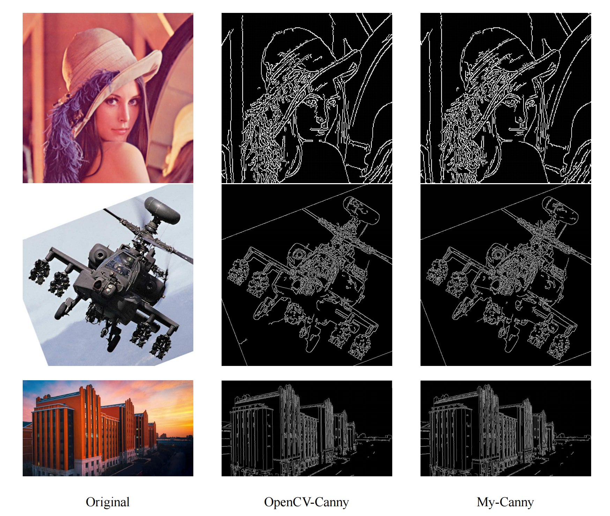

# ICE2607 Lab2: Canny Edge Detection

This project simplifies **Canny edge detection** with a command-line interface and customizable parameters. It also incorporates the Otsu method for **adaptive thresholding**.

## File Structure

- `codes/`
    - `images.py`: Contains the Image class.
    - `main.py`: Main Python script.
    - `modules.py`: Contains processing modules.
    - `utils.py`: Contains convolution and Otsu functions.
-  `tests/`
    - `opencv_figs`: Edge detection using OpenCV.
    - `step_figs`: Show images after each step.
- `images/`: Contains default test images.
- `examples/`: Contains edge detection results of default tests.
- `report_figures/`: Contains additional figures used in the report.
- `Lab2_report.pdf`
- `README.md`
- `Makefile`
- `requirements.txt`

## Example



## Install

1. Ensure that you have Python installed on your system.

2. Clone or download this project and navigate to the project directory.

3. Check if the dependencies listed in `requirements.txt` are installed. If not, create a virtual environment (if necessary) and run `make install`.

## Usage

### Default Canny Edge Detection
```
python -m codes.main \
    --input-dir path/to/input/folder \
    --output-dir path/to/output/folder \
    --output-type png
```

Note:
- `input-dir` can be path to the input image or the folder containing input images.
- Avoid duplicate filenames in `input-dir`.
- If the parameters are not specified, the program will utilize the three images in the **./images** directory as input and save all results in **PNG** format to the **./edges** directory.

### Personalize Parameters
```
python -m codes.main \
    --input-dir path/to/input/folder \
    --output-dir path/to/output/folder \
    --operator Sobel \
    --th-low 40 \
    --th-high 100 \
    --sigma 0.2
```

Note: 
- The `operator` can be selected from 'Roberts', 'Sobel', 'Prewitt', and 'Canny'. 
- Avoid duplicate filenames in `input-dir`.
- `th-low` will be set to 0.4 * `th-high` if not specified.

### Adaptive Thresholding
```
python -m codes.main \
    --input-dir path/to/input/folder \
    --output-dir path/to/output/folder \
    --otsu True
```

## Acknowledgements

https://github.com/khushitejwani/Canny-Edge-Detection-Using-Otsu-Thresholding